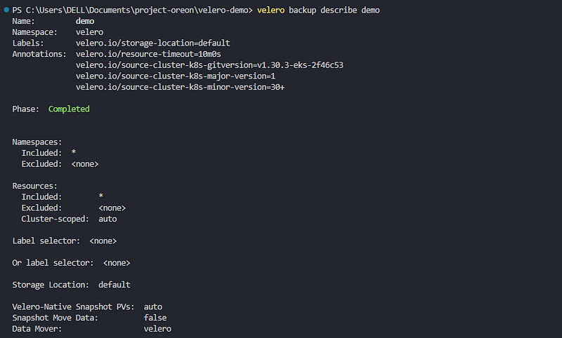
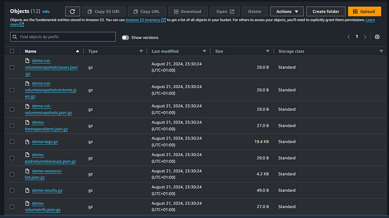
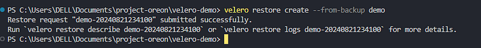
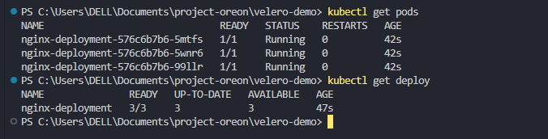

# Set up Velero on EKS Cluster

This repository demonstrates how to provision an EKS cluster and set up velero for cluster back ups and disaster recovery. To use this repository, you'll need the following installed and set up

- AWS CLI and Credentials Set
- Terraform Installed
- Ensure your AWS credential can create other Users
- Velero CLI installed

To use the repository, start by initializing terraform and apply the configuration using the command below:

```
terraform init
terraform validate
terraform apply --auto-approve
```
Update your kube config

```
aws eks update-kubeconfig --region us-east-1 --name velero
```

To demonstrate the backups process, create a sample nginx deployment from the manifest given in the project directory

```
kubectl apply -f manifest.yaml
```

Create a sample back up using velero

```
velero backup create demo
```

Describe the back up

```
velero backup describe demo
```



Confirm that back up is created in s3 bucket



## Demonstrate Back up Restore

To demonstrate that the back up process can be used to restore lost kubernetes objects, delete the nginx deplyoment and restore it back from velero backups in s3. 

```
kubectl delete -f manifest.yaml
```

restore the backup using the command below:

```
velero restore create --from-backup demo
```



Confirm that all resources are restored back as normal:



